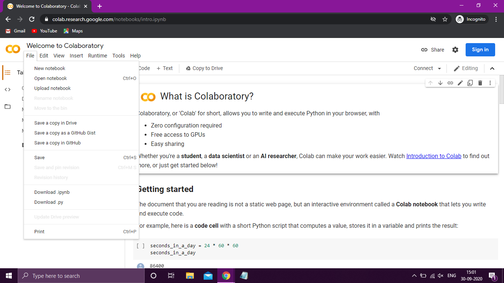
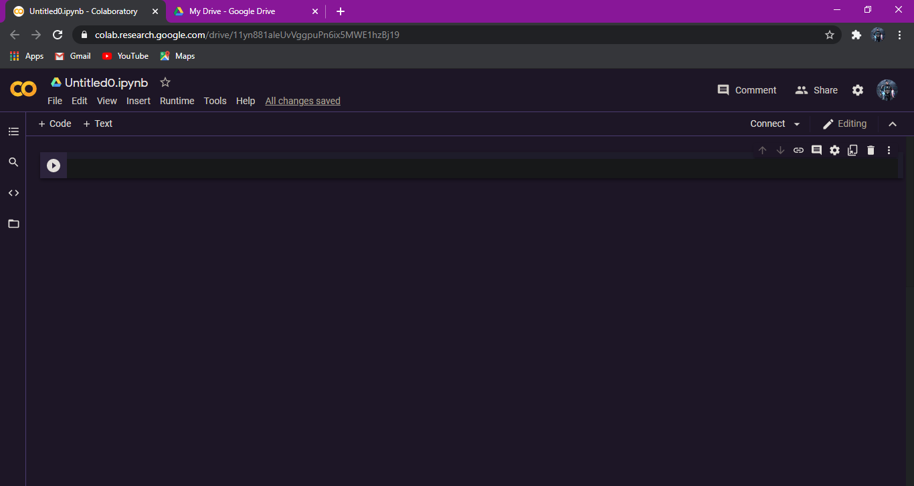

# Deep_meme


⏫ This is one of the things you will be able to do by following this workshop even with your image or video.

#### Why?
As I started learning ML, I wanted to create something visually awesome using AI (not just some numbers and graphs😪) but to make something awesome as the one above we must learn ML, DL and lots of maths. This workshop aims to introduce you to the world of Deep Learning and Deepfakes without discussing the mathematical and scary stuff. After this workshop you can have a taste of the superpower DL gives you, who knows you might fall in love with it😁. Also if you are not into codding so much but other domains (like painting) you might want to use this method too maybe in the following way😀


#### Here is another demo


⏫ The video(animation) on the far left is original video (driving video) which you can provide as input and the upper row of different images are the subject images, the lower row of videos is the output of the program.

### Few words about [AI](https://en.wikipedia.org/wiki/Artificial_intelligence), [ML](https://en.wikipedia.org/wiki/Machine_learning), [DL](https://en.wikipedia.org/wiki/Deep_learning) and [Deep-Fakes](https://en.wikipedia.org/wiki/Deepfake)
AI is one of those technologies which has changed (and going to change) the world completely, it can be easily compared to inventions like wheels and transistors. 
Machine Learning is a method under AI which uses data, math and code together to make machines intelligent🧠. It's almost similar to how a living being learns, we see a spoon daily and then we know it's a spoon based on it's characteristics. Deep Learning is a method under ML which uses more complex maths, [Neural Networks](https://en.wikipedia.org/wiki/Neural_network) (similar to how human brain has neurones) and lots of computations power (eats GPU for lunch 😅) to achieve greater feats such as self-driving cars.
Now we can <s>create</s> synthesise completely fake media file that look legit and we call those <b>DeepFakes</b>.
<br>

### Now Let's get Started 💻📈📉

<b>The tools/resources we are going to use are :</b>

- Your own google account 😁
- [Google Colab](https://colab.research.google.com/)
- python3 (included in colab)
- PyTorch library (included in colab but we need to ensure version 1.0.0)
- First-order-motion [model](https://github.com/AliaksandrSiarohin/first-order-model) (one of the most important)
- Google Drive
- Driving video (you can use your own or one of the demos)
- subject image(s) (again you can use your own, or from the demos)

<b>Google drive Setup</b>
Click on this link https://drive.google.com/drive/folders/1kZ1gCnpfU0BnpdU47pLM_TQ6RypDDqgw?usp=sharing and add teh folder to your google drive. It was created by the creator of "first order motion model" and contains almost all the resources and checkpoints you will need. Check once to confirm you have saved this folder in your drive.

<b>Colab </b>
Google Colab: It is a service provided by google where you can run your intensive codes on a powerful machine (you get GPU, good processor, enough RAM even TPU, you can choose the combination). When you open it, you will see the following screen.
Log in with your Google account.


Click on <b>files</b> and select <b>new notebook</b>.
You will see something like this 


You can see a line with a play button, that's called a cell where we write snippets of code and click on the play button to execute it.
Notice how I have another tab with my GDrive open, a good practice.

### Coding
Belove are some snippets of code which you just have to copy and paste in your colab cells and execute, a small explanation is given.

cell-1 
Deep learning is not very easy, in order to make it easy we are going to copy pre-trained checkpoints from Aliaksandr Siarohin (creator of first order motion) so that we get some pre-trained data.

```jupyter-notebook
!git clone https://github.com/AliaksandrSiarohin/first-order-model
```
cell-2

navigating to the right directory.
```python
cd first-order-model
```

cell-3

We have our resources in GDrive but we need to use those here in colab, so we are going to link both.
```python
from google.colab import drive
drive.mount('/content/gdrive')
```
