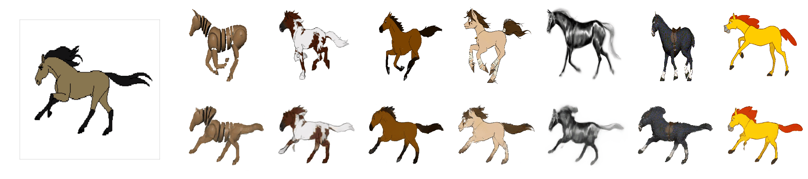

# Deep_meme

⏫ This is one of the things you will be able to do by following this workshop even with your image or video.

As I started learning ML, I wanted to create something visually awesome using AI (not just some numbers and graphs😪) but to make something awesome as the one above we must learn ML, DL and lots of maths. This workshop aims to introduce you to the world of Deep Learning and Deepfakes without discussing the mathematical and scary stuff. After this workshop you can have a taste of the superpower DL gives you, who knows you might fall in love with it😁. Also if you are not into codding so much but other domains (like painting) you might want to use this method too maybe in the following way😀

#### Here is another demo

⏫ The video(animation) on the far left is original video (driving video) which you can provide as input and the upper row of different images are the subject images, the lower row of videos is the output of the program.

### Simple intro to [AI](https://en.wikipedia.org/wiki/Artificial_intelligence), [ML](https://en.wikipedia.org/wiki/Machine_learning), [DL](https://en.wikipedia.org/wiki/Deep_learning) and [Deep-Fakes](https://en.wikipedia.org/wiki/Deepfake)
AI is one of those technologies which has changed (and going to change) the world completely, it can be easily compared to inventions like wheels and transistors. 
Machine Learning is a method under AI which uses data, math and code together to make machines intelligent🧠. It's almost similar to how a living being learns, we see a spoon daily and then we know it's a spoon based on it's characteristics. Deep Learning is a method under ML which uses more complex maths, [Neural Networks](https://en.wikipedia.org/wiki/Neural_network) (similar to how human brain has neurones) and lots of computations power (eats GPU for lunch 😅) to achieve greater feats such as self-driving cars.
Now we can <s>create</s> synthesise completely fake media file that look legit and we call those <b>DeepFakes .

